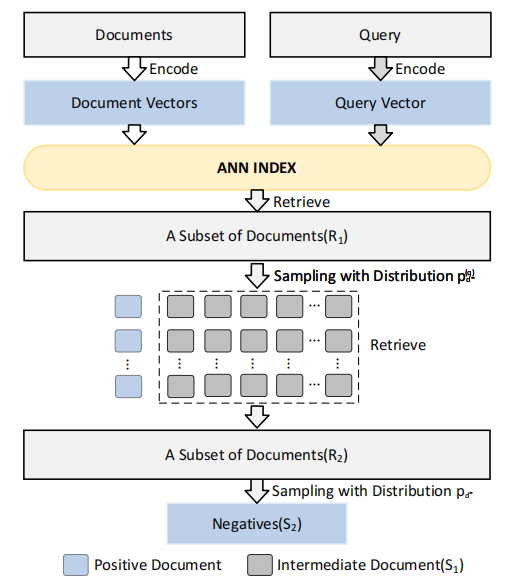
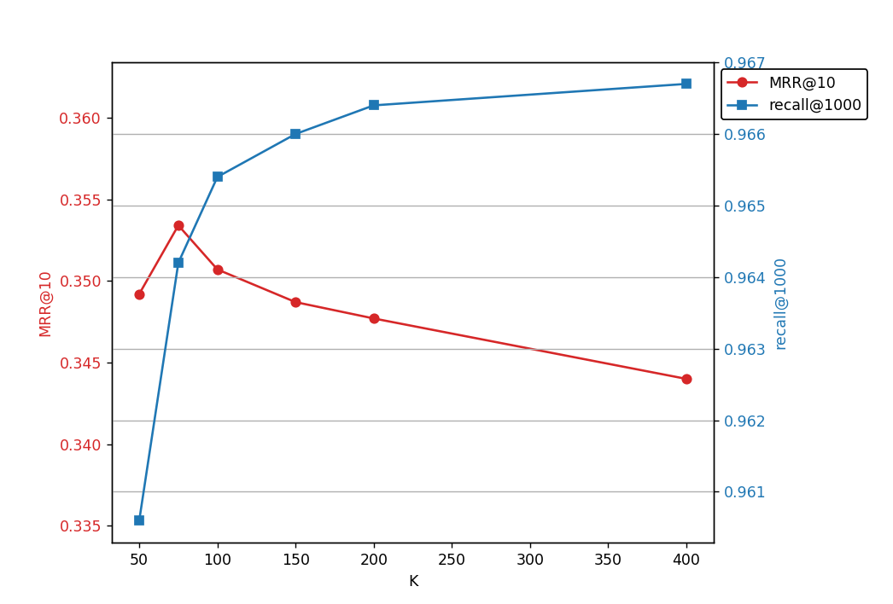

This is an early project and its corresponding code, which is for anonymization testing.  Given its initial stage, the code is far from its full - fledged state.  Therefore, it will be gradually supplemented and improved to achieve better performance and functionality. The code in this repository can run in some environments, but environment errors may occur in other environments.

This is the source code for the paper "ReSa2: A Two - Stage Retrieval - Sampling Algorithm for Negative Sampling in Dense Retrieval".  Tanonymization testing process and gain a deeper understanding of how it handles negative sampling to enhance the retrieval performance.

  

  

 

# Repository for Our Paper's Code

## Data

You can download the required dataset from the following webpage:  
[MS MARCO Datasets](https://microsoft.github.io/msmarco/Datasets.html)

---

## Training the stdDR Model

We use the document retrieval toolkit [Tevatron](https://github.com/texttron/tevatron) to train a dense retriever and evaluate the effectiveness of sampling negative samples. Based on the `bert-base-uncased` model, stdDPR is trained on the official triplets provided by the MS MARCO Passage Ranking dataset.

### Steps:
1. Run `setup_experiment.sh` to encode some data as preparation.
2. Execute `train_dr.sh` to train the stdDPR model for sampling.

---

## ReSa2 Sampling

1. **First-Stage Retrieval:** We perform the first-stage retrieval using FAISS, retrieving the top-1000 passages for each query.
2. **Negative Sampling:** We sample from the top-1000 using a probabilistic distribution ($p_s$), obtaining a subset of $K' = 500$.
3. **Second-Stage Retrieval:** We use the positive sample reuse retriever as a filter to reposition the negative samples in the sample pool obtained from the previous stage. The top-75 samples are selected, and seven negative samples are randomly chosen for each query to update the training set.
4. **Model Training:** Finally, we use the pre-trained language model `bert-base-uncased` to train a new model with the newly sampled negative samples for four epochs.

### Execution Steps:
- Run `ReSa2_sampling.sh` to complete the first-stage retrieval, sampling, and second-stage retrieval.
- Execute `train_and_test.sh` to finalize the sampling, train a new model, perform retrieval, and evaluate the results.

---

Enjoy using our code, and feel free to open an issue if you have any questions!

# Appendix

## Instruction
In this experiment, we replicated a series of methods and made certain adjustments to their parameters and sequences according to our evaluation criteria to achieve their best performance.

Due to the limited length of the main text, the settings and descriptions of each method are as follows.

### TopK
For the direct sampling of TopK hard negative samples, we randomly sampled from the hard negative samples ranked among the top 200 in the ANN. This is also the parameter setting for ANCE.  We also compared sampling with the optimal parameter of our method, which is 75. However, when the value of K was 200, the best results were obtained, and this value was adopted in the reporting of our paper. The results of sampling with Top75 and then conducting training are as follows:  
- MRR@10: **33.55**  
- Recall@1000: **94.9**  
- nDCG@10 (TREC-2019): **62.70**  
- nDCG@10 (TREC-2020): **59.42**  

These results are inferior to the results of Top200.

#### Performance metrics for DPR with different top-K settings across MS-MARCO, TREC-19, and TREC-20.

|  | **Top75** | **Top200** |
|---|---|---|
| **MRR@10** | 33.6 | 34.2 |
| **Recall@50** | 78.6 | 81.2 |
| **Recall@100** | 84.2 | 86.9 |
| **Recall@1000** | 94.9 | 96.2 |
| **nDCG@10 (TREC-19)** | 59.4 | 67.3 |
| **nDCG@10 (TREC-20)** | 62.7 | 66.9 |

---

### TriSampler
Regarding TriSampler, there are two different interpretations of the quasi-triangle principle mentioned in the original method. We replicated the method according to these two different interpretations and adopted the approach that can effectively screen out samples. In this approach, we denote it as **T1**. The setting of $\theta$ in this method is slightly different from the other one.

We denote:
- $\mathbf{V}_{d^+} - \mathbf{V}_q$ as $\mathbf{V}_1$
- $\mathbf{V}_{d^-} - \mathbf{V}_q$ as $\mathbf{V}_2$

These can be expressed as follows:

$`\mathbf{V}_1 = \mathbf{V}_{d^+} - \mathbf{V}_q`$

$`\mathbf{V}_2 = \mathbf{V}_{d^-} - \mathbf{V}_q`$

Next, we calculate the angle $\alpha$ between $\mathbf{V}_1$ and $\mathbf{V}_2$. According to the dot-product formula of vectors:

$$
\mathbf{a} \cdot \mathbf{b}=\|\mathbf{a}\| \|\mathbf{b}\| \cos\theta
$$

(where $\theta$ is the angle between $\mathbf{a}$ and $\mathbf{b}$), we obtain:

$$
\alpha = \arccos\left(\frac{\mathbf{V}_1 \cdot \mathbf{V}_2}{\|\mathbf{V}_1\| \|\mathbf{V}_2\|}\right)
$$

The other approach is denoted as **T2**. The calculation of $\theta$ in this approach is:

$`theta=\left|\arccos\left(\frac{s(\mathbf{v}_q,\mathbf{v}_{d^+})}{\|\mathbf{v}_q\| \cdot \|\mathbf{v}_{d^+}\|}\right)-\arccos\left(\frac{s(\mathbf{v}_q,\mathbf{v}_{d^-})}{\|\mathbf{v}_q\| \cdot \|\mathbf{v}_{d^-}\|}\right)\right|`$

We also solely employed these two principles to screen negative samples to examine the effectiveness. The specific results are presented in the table below. $\theta$ is set to 60 degrees for all cases.

#### Retrieval Performance of T1 and T2 Sampling Strategies on MS-MARCO.

| **Method** | **MRR@10** | **Recall@50** | **Recall@1000** |
|------------|-----------|--------------|---------------|
| **T1** | 34.9 | 80.9 | 95.9 |
| **T2** | 34.1 | 81.5 | 96.4 |

---

### SimANS

For SimANS, we also tested various parameters and extracted the final negative samples from the top $K$ hard negative samples in the ANN, based on the probability distribution of the similarity score distance. The experiments showed that $K$ = 400 is a reasonable choice, and this value was adopted in the paper. Meanwhile, through the ablation of TriSampler and our method, we found that compared with directly extracting the final samples, the probability distribution of the similarity score distance proposed by SimANS can achieve better results when further sampling after extracting the transition samples.

#### Retrieval Performance of SimANS with Varying Top-K Sampling.

| **Method** | **MRR@10** | **Recall@50** | **Recall@1000** | **TREC-19** | **TREC-20** |
|------------|-----------|--------------|---------------|------------|------------|
| **Top 100 SimANS** | 33.3 | 77.5 | 94.7 | - | - |
| **Top 200 SimANS** | 34.4 | 79.4 | 95.7 | 67.2 | 64.4 |
| **Top 300 SimANS** | 34.7 | 80.0 | 95.8 | 67.7 | 65.7 |
| **Top 400 SimANS** | 34.8 | 80.2 | 96.1 | 67.6 | 66.8 |
| **Top 500 SimANS** | 34.8 | 80.3 | 96.0 | 68.2 | 65.2 |

---
