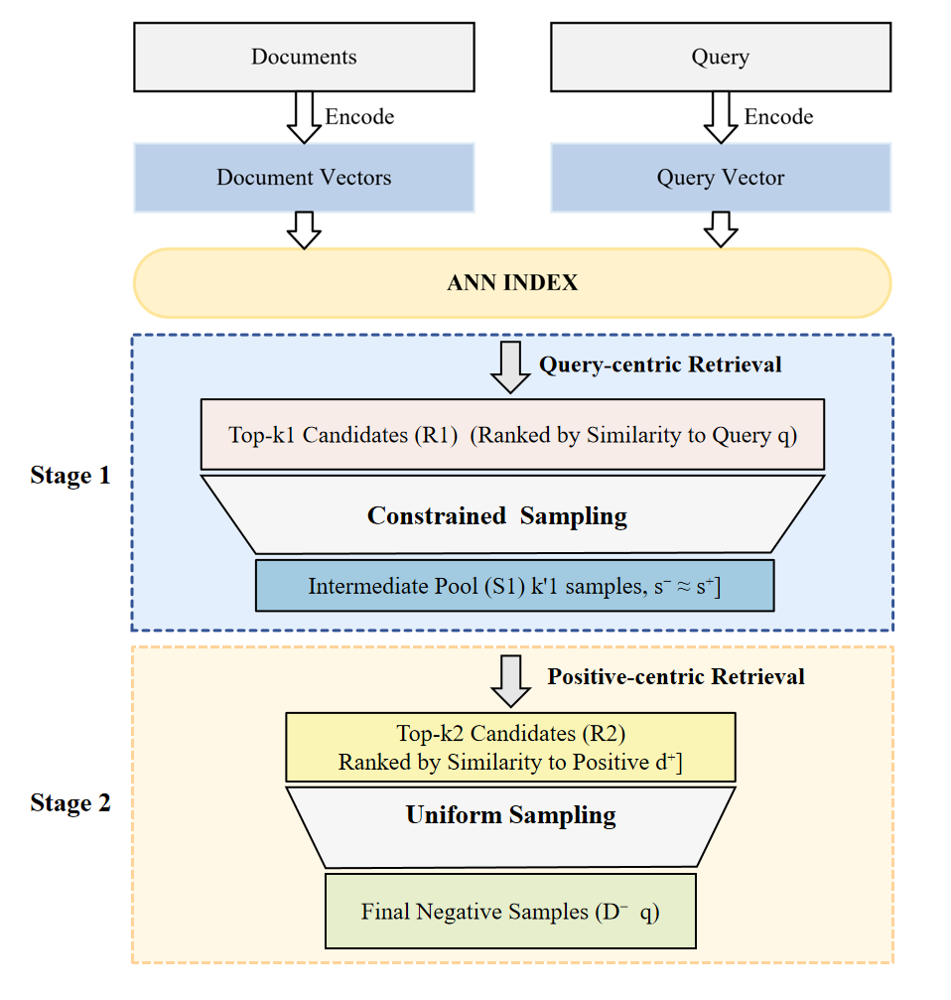
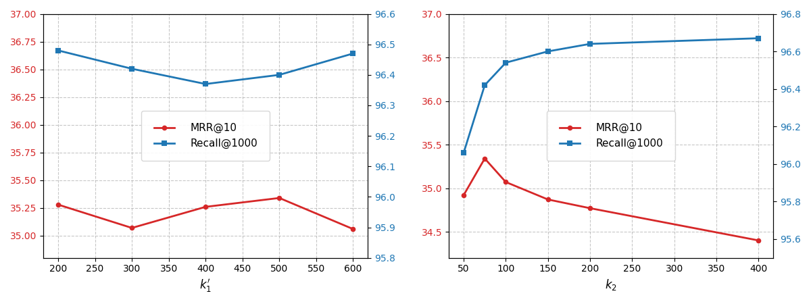
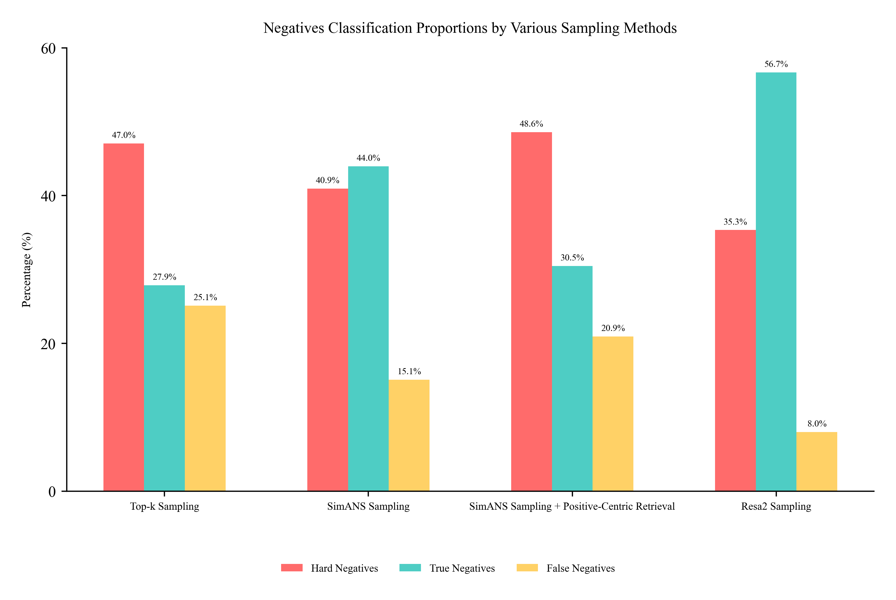
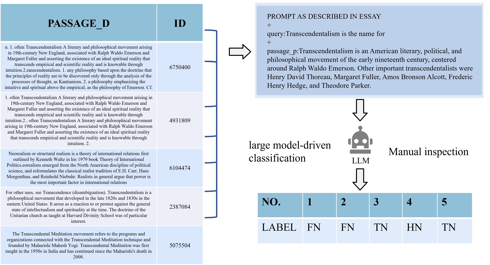
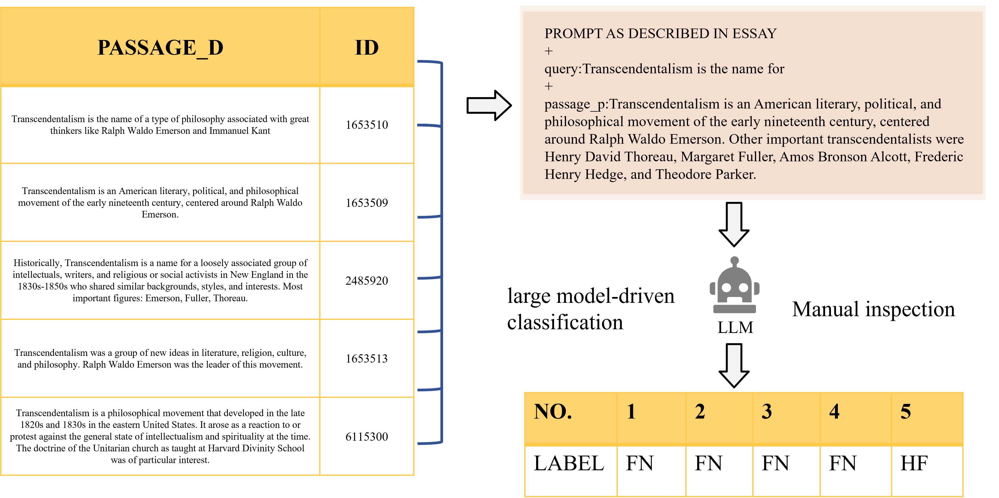

This is the source code for the paper "ReSa2: A Two - Stage Retrieval - Sampling Algorithm for Negative Sampling in Dense Retrieval".  

  

  

 

# Repository for Our Paper's Code

## Data

You can download the required dataset from the following webpage:  
[MS MARCO Datasets](https://microsoft.github.io/msmarco/Datasets.html)

---

## Training the stdDR Model

We use the document retrieval toolkit [Tevatron](https://github.com/texttron/tevatron) to train a dense retriever and evaluate the effectiveness of sampling negative samples. Based on the `bert-base-uncased` model, stdDPR is trained on the official triplets provided by the MS MARCO Passage Ranking dataset.

### Steps:
1. Run `setup_experiment.sh` to encode some data as preparation.
2. Execute `train_dr.sh` to train the stdDPR model for sampling.

---

## ReSa2 Sampling

1. **First-Stage Retrieval:** We perform the first-stage retrieval using FAISS, retrieving the top-1000 passages for each query.
2. **Negative Sampling:** We sample from the top-1000 using a probabilistic distribution ($p_s$), obtaining a subset of $K' = 500$.
3. **Second-Stage Retrieval:** We use the positive sample reuse retriever as a filter to reposition the negative samples in the sample pool obtained from the previous stage. The top-75 samples are selected, and seven negative samples are randomly chosen for each query to update the training set.
4. **Model Training:** Finally, we use the pre-trained language model `bert-base-uncased` to train a new model with the newly sampled negative samples for four epochs.

### Execution Steps:
- Run `ReSa2_sampling.sh` to complete the first-stage retrieval, sampling, and second-stage retrieval.
- Execute `train_and_test.sh` to finalize the sampling, train a new model, perform retrieval, and evaluate the results.

---

Enjoy using our code, and feel free to open an issue if you have any questions!
| Model | Negative selection | MS-MARCO |  |  | TREC-19 | TREC-20 |
|----|----|----|----|----|----|----|
|  |  | MRR@10 | R@50 | R@1k | nDCG@10 | nDCG@10 |
| BM25  | --- | 18.5 | 58.5 | 85.7 | 51.2 | 47.7 |
| DeepCT  | --- | 24.3 | 69.0 | 91.0 | 57.2 | - |
| docT5query  | --- | 27.7 | 75.6 | 94.7 | 64.2 | - |
| ANCE  | Static Hard Negatives | 33.0 | - | 95.9 | 64.5 | 64.6 |
| STAR  | Static Hard Negatives | 34.0 | - | - | 64.2 | - |
| ADORE  | Dynamic Hard Negatives | 34.7 | - | - | 68.3 | - |
| SEED  | Dynamic Hard Negatives | 33.9 | - | 96.1 | - | - |
| DPR+BM25 Neg | Static Hard Negatives | 32.4 | 79.0 | 95.4 | 59.4 | 62.7 |
| DPR+TopK Neg  | Static Hard Negatives | 34.2 | 81.2 | 96.2 | 67.3 | **66.9** |
| DPR+SimANS  | Denoised Hard Negatives | 34.8 | 80.2 | 96.1 | 67.6 | **66.9** |
| DPR+TriSampler | Denoised Hard Negatives | 34.9 | 80.9 | 95.9 | 65.4 | 62.8 |
| DPR+ReSa2 | Denoised Hard Negatives | **35.3** | **81.8** | **96.4** | **68.6** | 66.3 |

| Metric | Model | @1 | @3 | @5 | @10 | @100 |
|----------------|----------------|----------------|----------------|----------------|----------------|----------------|
| **NDCG** | DPR | 0.28563 | 0.37971 | 0.41444 | 0.44838 | 0.49494 |
|  | DPR+SimANS | 0.27723 | 0.362 | 0.39368 | 0.42388 | 0.47367 |
|  | DPR+ReSa2 | **0.30041** | **0.38955** | **0.42206** | **0.45463** | **0.50337** |
| **MAP** | DPR | 0.25381 | 0.34557 | 0.36601 | 0.38111 | 0.39113 |
|  | DPR+SimANS | 0.24889 | 0.33074 | 0.34931 | 0.36272 | 0.37359 |
|  | DPR+ReSa2 | **0.26895** | **0.35647** | **0.37543** | **0.39032** | **0.40100** |
| **Recall** | DPR | 0.25381 | 0.44899 | 0.52909 | **0.62865** | 0.83959 |
|  | DPR+SimANS | 0.24889 | 0.42454 | 0.4978 | 0.58596 | 0.80927 |
|  | DPR+ReSa2 | **0.26895** | **0.45553** | **0.53107** | 0.62522 | **0.84323** |
| **Precision** | DPR | 0.28563 | 0.17285 | 0.12370 | **0.07433** | 0.01011 |
|  | DPR+SimANS | 0.27723 | 0.16329 | 0.11593 | 0.06909 | 0.00975 |
|  | DPR+ReSa2 | **0.30041** | **0.17545** | **0.12381** | 0.07390 | **0.01017** |
| **MRR** | DPR | 0.28563 | 0.37553 | 0.39401 | 0.40669 | 0.41459 |
|  | DPR+SimANS | 0.27723 | 0.35849 | 0.37551 | 0.38712 | 0.3961 |
|  | DPR+ReSa2 | **0.30070** | **0.38644** | **0.40366** | **0.41582** | **0.42460** |

  

 
 
# Appendix

## A.Experiment Details

### Negatives Classification
Due to the increasingly powerful capabilities of large language models and inspired by the manual review of RocketQA, we believe that the metrics for sample sampling algorithms can be implemented by leveraging the model's classification ability for query-sample pairs, combined with manual spot checks to ensure reliability. Meanwhile, the relabeling of datasets by artificial intelligence can alleviate part of the false negative problem, but this does not mean that sampling algorithms lose their value. For extremely large datasets, even if AI reduces costs, the labeling effort remains enormous. Two specific examples are provided in Figure. [llm](img/LLM.png) and Figure. [llm2](img/LLM2.png).

We used DeepSeek-V3-0324 for relevant discrimination and adopted the following prompt:

> **Please judge the relevance between the following paragraph and the query:**
> 
> Query: `{query}`
> 
> Relevant passage: `{passage_p}`
> 
> Paragraph to be judged: `{passage_d}`
> 
> **Decision criteria**:
> - If the paragraph to be judged is closer to the relevant passage than the query, return **False Negative (FN)**.
> - If the paragraph to be judged is completely irrelevant to the query, return **True Negative (TN)**.
> - If the paragraph to be judged is irrelevant to the query but relatively close to the correct answer, return **Hard Negative (HN)**.
> 
> **Only return FN, TN, or HN without additional information.**

*Figure [llm](image/LLM.png): Example of Analyzing ReSa2 Sampling Results with Large Language Models*

*Figure [llm2](image/LLM2.png): Example of Analyzing Top-K Sampling Results with Large Language Models* 

### Training Details
We use a standard DPR model (stdDPR) on the MS MARCO Passage Ranking dataset to obtain hard negative samples. We utilize Tevatron, a Unified Document Retrieval Toolkit, to train the dense retriever for testing the effectiveness of the sampled negative samples.

Based on the bert-base-uncased model, stdDPR is trained on the official triples provided by the MS MARCO Passage Ranking dataset, which consist of negative samples extracted from the top-1000 BM25 retrieval results combined with positive samples. Each training instance consists of one positive sample and seven negative samples, with a maximum query length of 32 and a maximum passage length of 128.

The model is trained for four epochs with a learning rate of 5e-6 and a per-device batch size of 16. For the optimizer, we choose AdamW, and set the weight decay to 0.

We use stdDPR to encode and retrieve on the training set. The process is as follows:
1. First, we perform the first-stage retrieval using faiss, retrieving the top-1000 ($\mathbf{k_1}$=1000) passages for each query.
2. Subsequently, we sample from the top-1000 using a probabilistic distribution ($p_s(d^-)$ ), obtaining a subset of $\mathbf{k_1'}$ = 500.
3. In the second-stage retrieval, we use the positive sample reuse retriever as a filter to reposition the negative samples in the sample pool obtained from the previous stage. We select the top-75 ($\mathbf{k_2}$=75) samples from it and randomly sample seven negative samples for each query to update the training set.

Finally, we use the pre-trained language model `bert-base-uncased` to train a new model with the newly sampled negative samples for four epochs. Then, we take the evaluation metrics of the new model as the criteria to reflect the quality of the negative samples.

To obtain a relatively fair evaluation, the other sampling algorithms we reproduced followed the same process as our sampling algorithm. Specifically:
- The BM-25 sampling method was trained using the official triples provided.
- For other sampling methods that we reproduced, negative samples were all extracted from the retrieval results of stdDPR.
- When training the models, the same base model was used, and hyperparameters such as four training epochs and a learning rate of 5e-6 were set identically.
- In the evaluation process, the same evaluation metrics, the Mean Reciprocal Rank @10(MRR@10) and Recall@1000, were employed to measure the model performance, thus ensuring that the comparison among different sampling algorithms was based on consistent conditions.

### Parameter Tuning
In our experiment, the number $n$ of the final negative samples was set to 7, and $k_1$ was fixed at 1000. For the sizes of $S_1$ and $R_1$ in the two-stage sampling, we also have two parameters, $k_1'$ and $k_2$.

We investigated the impact of the changes of these two parameters on the sample quality. The specific details are shown in Fig [can](img/e4.png). It can be seen that:
- When $k_2$ is fixed, the changes in $k_1'$ have a relatively mild impact on Recall@1000 and MRR@10.
- When $k_1$ remains unchanged, within a certain range, as $k_2$ decreases, Recall@1000 drops slightly, while MRR@10 increases significantly. When $k_2$ is smaller than this range, both of these two indicators will decline. The reason might be that samples with higher similarity are more likely to be false-negative samples.

*Figure [can](img/e4.png): Description of the performance metrics under different parameter values in the retrieval sampling process* 

## B.Algorithm Instruction
In this experiment, we replicated a series of methods and made certain adjustments to their parameters and sequences according to our evaluation criteria to achieve their best performance.

Due to the limited length of the main text, the settings and descriptions of each method are as follows.

### TopK
For the direct sampling of TopK hard negative samples, we randomly sampled from the hard negative samples ranked among the top 200 in the ANN. This is also the parameter setting for ANCE.  We also compared sampling with the optimal parameter of our method, which is 75. However, when the value of K was 200, the best results were obtained, and this value was adopted in the reporting of our paper. The results of sampling with Top75 and then conducting training are as follows:  
- MRR@10: **33.55**  
- Recall@1000: **94.9**  
- nDCG@10 (TREC-2019): **62.70**  
- nDCG@10 (TREC-2020): **59.42**  

These results are inferior to the results of Top200.

#### Performance metrics for DPR with different top-K settings across MS-MARCO, TREC-19, and TREC-20.

|  | **Top75** | **Top200** |
|---|---|---|
| **MRR@10** | 33.6 | 34.2 |
| **Recall@50** | 78.6 | 81.2 |
| **Recall@100** | 84.2 | 86.9 |
| **Recall@1000** | 94.9 | 96.2 |
| **nDCG@10 (TREC-19)** | 59.4 | 67.3 |
| **nDCG@10 (TREC-20)** | 62.7 | 66.9 |

---

### TriSampler
Regarding TriSampler, there are two different interpretations of the quasi-triangle principle mentioned in the original method. We replicated the method according to these two different interpretations and adopted the approach that can effectively screen out samples. In this approach, we denote it as **T1**. The setting of $\theta$ in this method is slightly different from the other one.

We denote:
- $\mathbf{V}_{d^+} - \mathbf{V}_q$ as $\mathbf{V}_1$
- $\mathbf{V}_{d^-} - \mathbf{V}_q$ as $\mathbf{V}_2$

These can be expressed as follows:

$`\mathbf{V}_1 = \mathbf{V}_{d^+} - \mathbf{V}_q`$

$`\mathbf{V}_2 = \mathbf{V}_{d^-} - \mathbf{V}_q`$

Next, we calculate the angle $\alpha$ between $\mathbf{V}_1$ and $\mathbf{V}_2$. According to the dot-product formula of vectors:

$$
\mathbf{a} \cdot \mathbf{b}=\|\mathbf{a}\| \|\mathbf{b}\| \cos\theta
$$

(where $\theta$ is the angle between $\mathbf{a}$ and $\mathbf{b}$), we obtain:

$$
\alpha = \arccos\left(\frac{\mathbf{V}_1 \cdot \mathbf{V}_2}{\|\mathbf{V}_1\| \|\mathbf{V}_2\|}\right)
$$

The other approach is denoted as **T2**. The calculation of $\theta$ in this approach is:

$`theta=\left|\arccos\left(\frac{s(\mathbf{v}_q,\mathbf{v}_{d^+})}{\|\mathbf{v}_q\| \cdot \|\mathbf{v}_{d^+}\|}\right)-\arccos\left(\frac{s(\mathbf{v}_q,\mathbf{v}_{d^-})}{\|\mathbf{v}_q\| \cdot \|\mathbf{v}_{d^-}\|}\right)\right|`$

We also solely employed these two principles to screen negative samples to examine the effectiveness. The specific results are presented in the table below. $\theta$ is set to 60 degrees for all cases.

#### Retrieval Performance of T1 and T2 Sampling Strategies on MS-MARCO.

| **Method** | **MRR@10** | **Recall@50** | **Recall@1000** |
|------------|-----------|--------------|---------------|
| **T1** | 34.9 | 80.9 | 95.9 |
| **T2** | 34.1 | 81.5 | 96.4 |

---

### SimANS

For SimANS, we also tested various parameters and extracted the final negative samples from the top $K$ hard negative samples in the ANN, based on the probability distribution of the similarity score distance. The experiments showed that $K$ = 400 is a reasonable choice, and this value was adopted in the paper. Meanwhile, through the ablation of TriSampler and our method, we found that compared with directly extracting the final samples, the probability distribution of the similarity score distance proposed by SimANS can achieve better results when further sampling after extracting the transition samples.

#### Retrieval Performance of SimANS with Varying Top-K Sampling.

| **Method** | **MRR@10** | **Recall@50** | **Recall@1000** | **TREC-19** | **TREC-20** |
|------------|-----------|--------------|---------------|------------|------------|
| **Top 100 SimANS** | 33.3 | 77.5 | 94.7 | - | - |
| **Top 200 SimANS** | 34.4 | 79.4 | 95.7 | 67.2 | 64.4 |
| **Top 300 SimANS** | 34.7 | 80.0 | 95.8 | 67.7 | 65.7 |
| **Top 400 SimANS** | 34.8 | 80.2 | 96.1 | 67.6 | 66.8 |
| **Top 500 SimANS** | 34.8 | 80.3 | 96.0 | 68.2 | 65.2 |

---

## C.Dependence on Dense Retriever Quality
To verify whether our method is effective on weak retrievers, we conducted relevant experiments. We carried out experiments in a "weak retriever" scenario constructed using BERT-base, a relatively basic pre-trained language model (PLM). To control the quality of the retriever, we sampled 10,000 queries from the original training set to construct a new small dataset, and trained the retriever on this dataset.

Under this setup, the Mean Reciprocal Rank (MRR) metrics of TopK sampling, TriSampler, and our ReSa2 method reached 22.0, 22.7, and 22.9 respectively. This result indicates that our method can still be effective in constrained environments.

| Sampling Method | MRR Metric |
| ---- | ---- |
| TopK Sampling | 22.0 |
| TriSampler | 22.7 |
| ReSa2 Method | 22.9 |

## D.Subjective Bias in Manual Validation
To reduce subjective bias in false negative detection, we have supplemented detailed validation procedures and quantitative data.

This false negative detection involved 40,000 query-passage pairs, with annotation tasks categorized into three classes: "False Negative", "True Negative", and "Hard Negative".

To minimize subjective bias, we adopted a two-layer validation process combining "LLM pre-annotation + manual review":
- First, the LLM independently classified all samples in two rounds. Samples with inconsistent results between the two rounds (6,241 in total, accounting for 15.6% of the total) were fully included in manual review.
- For samples with consistent LLM annotations across the two rounds (33,759 in total), 20% (6,752 samples) were randomly selected for manual review to ensure coverage.
- Manual annotations were completed independently by two authors. Samples with inconsistent annotations between the two authors (892 in total, accounting for 9.8% of the manually reviewed samples) were arbitrated by a third author to determine the final labels. According to annotation records:
    - Among samples with consistent LLM annotations, the agreement with the final manual judgments was 82.3%, indicating that LLMs have good reliability in high-confidence scenarios.
    - For all sampled samples, the Cohen’s kappa coefficient between the two annotators was 0.71. 

## E. Time Complexity Analysis of the ReSa2 Algorithm

The time complexity of the ReSa2 algorithm is determined by three core operations: ANN index construction, two-stage retrieval, and two-stage sampling. Herein, we assume the employed ANN indexing algorithm is Hierarchical Navigable Small Worlds (HNSW), and conduct a quantitative analysis by leveraging the structural characteristics of HNSW.

### HNSW and Index Construction Complexity

As a mainstream and efficient structure for Approximate Nearest Neighbor (ANN) search, HNSW organizes document vectors (with the total number of documents denoted as $N$) through a hierarchical navigation graph. Its construction process requires dynamic maintenance of connection relationships and node distribution across multiple graph layers, resulting in a time complexity of $O(N \log N)$. This operation dominates the overall time cost of the algorithm: when the document scale $N$ reaches the million or even billion level (e.g., the 8.84 million documents in MS MARCO), the complexity of index construction is far higher than that of other low-order operations, directly determining the upper time limit of the algorithm.

### HNSW Retrieval Performance and Retrieval Complexity

The retrieval performance of HNSW relies on a hierarchical navigation mechanism, which avoids full-scale traversal. Its time complexity is determined by the global scale of the index, being $O(\log N)$ (independent of the number of returned results $k$); thus, the time complexity of both stages in the two-stage retrieval is $O(\log N)$.

### Two-stage Sampling Steps and Corresponding Complexities

Two-stage sampling involves the following steps with distinct time complexities:

- **First-stage sampling**: Based on the Gaussian kernel probability distribution (Equation $10$, which can be represented as $P(x) \sim \mathcal{N}(\mu, \sigma^{2})$ where $x$ is the sample, and $\mu$ and $\sigma$ are the mean and standard deviation respectively), $k_1'$ samples are selected from $R_1$ (with a scale of $k_1$). The time complexity of this process is $O(k_1 + k_1')$.

- **Second-stage sampling**: Uniform sampling is performed: based on a uniform distribution (Equation $13$, which can be denoted as $U(a, b)$ representing a uniform distribution over the interval $[a, b]$), $m$ final negative samples are selected from $R_2 \setminus \{d^{+}\}$ (with a scale of $k_2$). This operation only involves random filtering, resulting in a time complexity of $O(n)$.

### Overall Complexity Conclusion

In large-scale document scenarios, the $O(N \log N)$ complexity of HNSW index construction is absolutely dominant. In contrast, the total complexity of the two-stage retrieval $O(\log N)$ and the complexity of the two-stage sampling ($O(k_1) + O(n)$) are both low-order terms (where $k_1$ and $k_2$ are usually much smaller than $N$). Therefore, the overall time complexity of the ReSa2 algorithm is ultimately $O(N \log N)$, which is on the same order of magnitude as that of SimANS and TriSampler. This enables ReSa2 to maintain efficient operation in document corpora ranging from the million to billion levels. 
